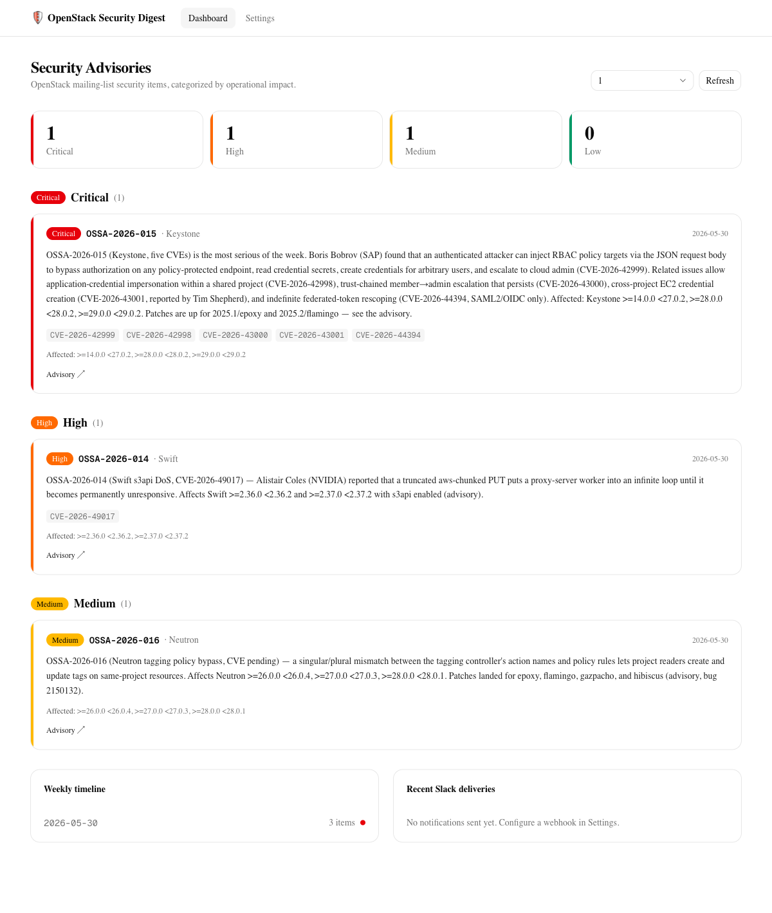

# OpenStack Security Digest

[](https://github.com/bluejayA/openstack-security-digest/actions/workflows/ci-server.yml)
[](https://github.com/bluejayA/openstack-security-digest/actions/workflows/ci-web.yml)
[](https://github.com/bluejayA/openstack-security-digest/actions/workflows/security.yml)
[](https://github.com/bluejayA/openstack-security-digest/actions/workflows/codeql.yml)
[](https://github.com/bluejayA/openstack-security-digest/actions/workflows/dependency-review.yml)
[](server/go.mod)
[](web/package.json)
[](LICENSE)

> OpenStack 메일링리스트의 주간 보안 공지를 **자동으로 필터링·영향도 분류**하고,
> **Slack으로 푸시**하며, **대시보드**로 보여주는 서비스.

[Stackers Network](https://stackers.network)가 발행하는 주간 OpenStack 다이제스트(`feed.xml`)를
받아 **Security 섹션만 추출**하고, 각 공지를 **운영 영향도(Critical/High/Medium/Low)**로 분류한 뒤:

- **REST API**로 제공하고,
- **대시보드**(영향도별 그룹 + 주간 타임라인)로 렌더링하며,
- 새 다이제스트가 나오면 **임계 영향도 공지를 Slack에 자동 푸시**하고,
- (선택) Claude API로 **공지 본문을 한국어로 번역**해 표시·푸시합니다(콘텐츠 해시 캐시, 기술 식별자는 원문 유지).



---

## 목적 및 배경

OpenStack 운영자는 보안 패치 적용 타이밍이 곧 사고 예방입니다. 그러나 보안 공지(OSSA/OSSN/CVE)는
`openstack-discuss` 메일링리스트에 다른 수많은 개발·거버넌스 트래픽과 섞여 흘러갑니다.
주간 다이제스트가 이를 요약해 주지만, 여전히 사람이 매주 글을 열어 **"이게 우리 환경에 급한가?"**를
판단해야 합니다.

이 서비스는 그 판단의 1차 분류를 자동화합니다.

- **놓침 방지** — 메일링리스트를 직접 구독·정독하지 않아도 보안 항목만 추려서 받습니다.
- **우선순위화** — "클라우드 admin 탈취"와 "단일 워커 DoS"를 같은 무게로 다루지 않도록 영향도로 나눕니다.
- **즉시성** — 임계 등급(Critical/High)은 새 다이제스트 발행 즉시 Slack으로 알립니다.
- **결정성** — 분류는 LLM이 아니라 **규칙 기반**입니다. 비용이 없고, 결과가 재현 가능하며, 감사할 수 있습니다.

---

## 핵심 사용자 시나리오

| # | 사용자 | 시나리오 |
|---|--------|----------|
| 1 | **보안 담당자** | 매주 메일을 뒤지는 대신, Slack 채널에서 Critical/High 공지만 색상·CVE·영향 버전과 함께 받아 본다. |
| 2 | **운영/SRE** | 대시보드에서 최근 N주의 보안 공지를 영향도별로 한눈에 보고, 우리가 쓰는 컴포넌트(Keystone, Neutron 등)의 패치 필요 여부를 빠르게 판단한다. |
| 3 | **팀 리드** | 임계치를 "Critical만"으로 설정해 노이즈를 줄이고, 정말 급한 것만 알림 받는다. 폴링 주기와 알림 임계치를 설정 UI에서 조정한다. |
| 4 | **신규 합류자** | 주간 타임라인으로 지난 몇 주간 어떤 보안 이슈가 있었는지 히스토리를 따라잡는다. |
| 5 | **연동 개발자** | REST API(`/api/security`)를 호출해 다른 내부 시스템(티켓 자동 생성, 위키 등)에 보안 데이터를 흘려보낸다. |

---

## 아키텍처

```
  stackers.network/feed.xml
            │
            ▼
   ┌─────────────────────────────────────────────────────────┐
   │ Go 백엔드 (server/)                                       │
   │  Fetcher → RSS Parser → Security Extractor → Classifier   │
   │  ├─ Scheduler : 주기 폴링 → 신규 digest 감지 → Slack 푸시 │
   │  ├─ Slack     : Incoming Webhook + Block Kit             │
   │  ├─ SQLite    : settings / seen digests / deliveries     │
   │  └─ REST API  : /api/security, /api/settings, …          │
   └─────────────────────────────────────────────────────────┘
            │ JSON (CORS)
            ▼
   ┌─────────────────────────────────────────────────────────┐
   │ Next.js + Tailwind v4 + shadcn/ui (web/)                  │
   │  Dashboard (영향도 그룹, 주간 타임라인, 전송 상태)        │
   │  Settings  (webhook, 임계치, 폴링 주기, 범위)            │
   └─────────────────────────────────────────────────────────┘
```

### 처리 파이프라인

1. **Fetcher** — `feed.xml`을 HTTP GET, 파싱 결과를 TTL 동안 in-memory 캐시 (상류는 ~15분마다 갱신).
2. **RSS Parser** — `encoding/xml`로 item(title/link/guid/pubDate/`content:encoded`) 파싱.
3. **Security Extractor** — `golang.org/x/net/html`로 `<h2 id="security">` 섹션을 파싱, 각 `<li>`/`<p>`를 공지(OSSA/OSSN ID, CVE 목록, 컴포넌트, 영향 버전, 본문, 링크)로 추출.
4. **Classifier** — 규칙 기반 영향도 산정 (아래 표).
5. **Scheduler** — 주기적으로 폴링하여 새 `guid`를 감지하고, 임계치 이상 공지를 Slack에 푸시. 중복 전송 방지, 콜드스타트 시 백필 방지, 전송 실패 시 재시도.
6. **REST API / Dashboard** — 영향도별로 그룹핑하여 제공·표시.

### 영향도 분류 규칙 (결정적, LLM 미사용)

| 카테고리 | 트리거 신호 (예) |
|----------|------------------|
| **Critical** | `escalate to cloud admin`, RCE, 인증 우회 |
| **High** | `authorization/policy bypass`, 권한 상승, credential 유출 |
| **Medium** | DoS, infinite loop, 정보 노출 |
| **Low** | 운영 노트(OSSN), 경미·국소 이슈 |

**보정 규칙**: 광범위 영향(`all 2026.x deployments`, `permanently`)은 한 단계 상향, 국소 범위(`project reader`, `same-project`)는 High→Medium 하향, CVE 3건 이상 묶음은 한 단계 상향.

> 실제 예: `OSSA-2026-015`(Keystone, 클라우드 admin 탈취, CVE 5건) → **Critical**,
> `OSSA-2026-014`(Swift s3api DoS, 영구 무응답) → **High**,
> `OSSA-2026-016`(Neutron 태깅 우회, project-reader 한정) → **Medium**.

---

## 기술 스택

| 영역 | 선택 | 비고 |
|------|------|------|
| 백엔드 | **Go** (stdlib `net/http`) | 프레임워크 없이 표준 라이브러리, 단일 바이너리 |
| HTML 파싱 | `golang.org/x/net/html` | 정규식보다 견고한 구조 파싱 |
| 저장소 | **SQLite** (`modernc.org/sqlite`) | 순수 Go 드라이버(CGO 불필요), 단일 파일 |
| 알림 | **Slack Incoming Webhook** + Block Kit | |
| 프런트엔드 | **Next.js 16** + React 19 | App Router |
| 스타일 | **Tailwind CSS v4** + **shadcn/ui** | |
| 데이터 패칭 | **SWR** | 자동 재검증·캐싱 |
| 테스트 | Go `testing` (실제 피드 픽스처) + Playwright E2E | |

---

## Quick Start

### 사전 요구사항
- Go ≥ 1.26
- Node.js ≥ 20

### 1) 백엔드 (API + 스케줄러)

```bash
cd server
go test ./...            # 테스트 (피드 픽스처로 네트워크 없이 실행)
go run ./cmd/server      # http://localhost:8080 에서 기동
```

확인:
```bash
curl "http://localhost:8080/api/security?weeks=1" | jq '{count, totals}'
```

### 2) 프런트엔드 (대시보드 + 설정)

```bash
cd web
npm install
npm run dev              # http://localhost:3000  (백엔드 :8080 필요)
```

`web/.env.local`의 `NEXT_PUBLIC_API_BASE`로 API 주소를 지정합니다(기본 `http://localhost:8080`).

### 3) Slack 알림 켜기
1. Slack **Incoming Webhook**을 생성하고 URL을 **Settings**에 입력.
2. **임계치**(예: *High and above*)를 고르고 **Auto-push**를 켠다.
3. *Send test message*로 webhook 연결을 확인한다.
4. 이후 새 다이제스트가 발행되면 임계치 이상 공지가 자동으로 전송된다.

---

## 환경 변수 (백엔드)

| 변수 | 기본값 | 용도 |
|------|--------|------|
| `ADDR` | `:8080` | 리슨 주소 |
| `DB_PATH` | `./data/digest.db` | SQLite 파일 경로 |
| `FEED_URL` | `https://stackers.network/feed.xml` | 피드 출처 (테스트 시 오버라이드) |
| `FEED_CACHE_TTL` | `10m` | 피드 in-memory 캐시 TTL |

---

## API

| 메서드 | 경로 | 설명 |
|--------|------|------|
| GET | `/api/security?weeks=N` | 최근 N주 다이제스트의 공지 (영향도별 그룹) |
| GET | `/api/security?from=&to=` | 날짜 범위(`YYYY-MM-DD`, `to` 당일 포함) |
| GET | `/api/settings` | 현재 설정 |
| PUT | `/api/settings` | 설정 변경 |
| POST | `/api/settings/test` | 설정된 webhook으로 테스트 메시지 전송 |
| GET | `/api/deliveries` | 최근 Slack 전송 이력 |
| GET | `/healthz` | 헬스체크 |

`/api/security` 응답 예시:

```jsonc
{
  "count": 3,
  "totals": { "Critical": 1, "High": 1, "Medium": 1 },
  "groups": {
    "Critical": [ { "id": "OSSA-2026-015", "component": "Keystone",
                    "cves": ["CVE-2026-42999", "..."], "impact": "Critical",
                    "affected": [">=14.0.0 <27.0.2", "..."],
                    "digestDate": "2026-05-30", "link": "https://..." } ]
  },
  "digests": [ { "date": "2026-05-30", "count": 3, "topRank": 4 } ]
}
```

---

## 동작 보장

- **중복 전송 방지** — 공지별 delivery key로 한 번만 전송.
- **콜드스타트 백필 방지** — 최초 폴링은 기존 다이제스트를 조용히 baseline 처리(과거 N주 무더기 전송 없음).
- **전송 실패 재시도** — 일시적 webhook/네트워크 실패는 `sent`로 기록되지 않아 다음 사이클에 재시도(알림 누락 방지).

---

## 프로젝트 구조

```
server/                      Go 서비스
  cmd/server/                main / 의존성 연결
  internal/feed/             피드 fetch + RSS 파싱
  internal/security/         Security 섹션 추출 + 영향도 분류기
  internal/store/            SQLite (settings, seen digests, deliveries)
  internal/slack/            Block Kit + webhook 전송
  internal/scheduler/        폴링 → 신규 감지 → 알림
  internal/api/              REST 핸들러
  testdata/feed.xml          실제 피드 픽스처 (오프라인 테스트)
web/                         Next.js 대시보드 + 설정
  src/app/                   페이지 (대시보드 /, 설정 /settings)
  src/components/            advisory 카드, impact 뱃지, nav, shadcn/ui
  src/lib/                   API 클라이언트, 영향도 스타일
```

---

## 개발 / 검증

```bash
# 백엔드
cd server && go test ./... && go vet ./... && gofmt -l .

# 프런트엔드
cd web && npm run lint && npm run build
```

테스트는 `server/testdata/feed.xml`(실제 피드 스냅샷)을 사용해 네트워크 없이 결정적으로 실행됩니다.

---

## Kubernetes 배포

server + web을 단일 인그레스(`/api`·`/healthz` → server, `/` → web) 뒤에 배포합니다.
SQLite + 스케줄러 싱글톤 제약 때문에 **server는 단일 복제본 + PVC + `Recreate`** 전략입니다.

```bash
docker build -f server/Dockerfile -t oss-digest-server:local server/
docker build -f web/Dockerfile    -t oss-digest-web:local    web/
kubectl apply -k deploy/overlays/local
```

매니페스트·아키텍처 결정·프로덕션 전환 가이드는 [`deploy/README.md`](deploy/README.md) 참고.
버전 태그(`v*`) push 시 [`release-images.yml`](.github/workflows/release-images.yml)이
멀티아키텍처 이미지를 GHCR에 빌드·푸시합니다.

---

## 라이선스

[MIT](LICENSE) © 2026 Jay Ahn
